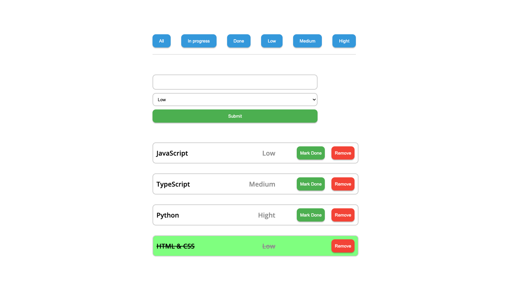

# Todo List

- Завдання TODO LIST (https://ibb.co/tJNV95f)
- Створи форму за допомогою якої можливо додавати свої завдання до їх списку
- Форма має містити input для опису завдання та select для можливості вибору
  пріоритетності цього завдання (https://ibb.co/4msvtLc)
- Після сабміту форми відмалюй завдання в списку
- Кожен елемент списку має містити: опис завдання, його пріоритетність, кнопку,
  щоб позначити його як виконане та кнопку для можливості видалення цього
  завдання (https://ibb.co/GJwsbRz)
- Після того, як статус завдання змінився на виконаний, текст завдання потрібно
  перекреслити, фон має змінитись на зелений, а кнопка для зміни статусу має
  зникнути (https://ibb.co/S0Z81bg)
- Після кліку на кнопку видалити, завдання видаляється зі списку
- Після перезавантаження сторінки всі завдання зберігаються в списку відповідно
  до свого статусу // Додай можливість сортування списку завдань
  (https://ibb.co/CBhR78H)

  
